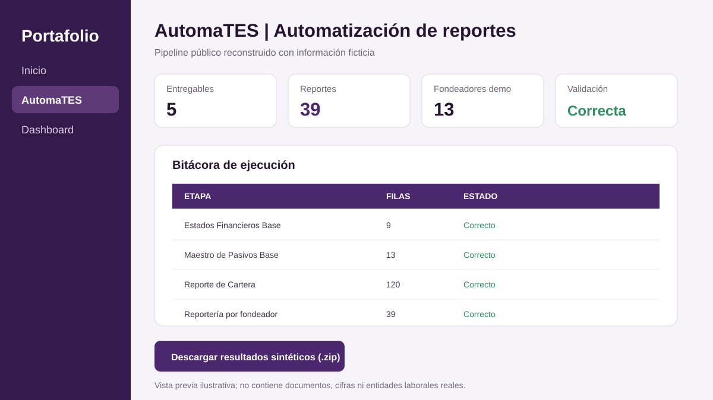
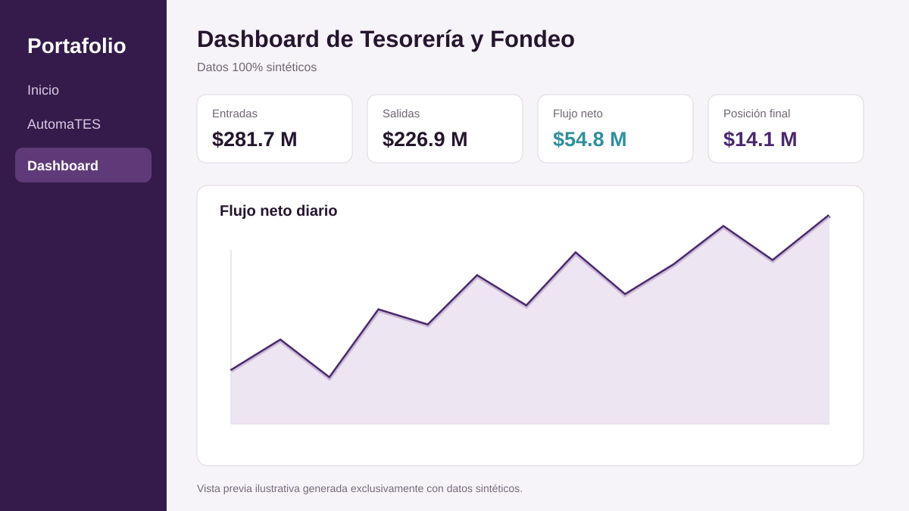
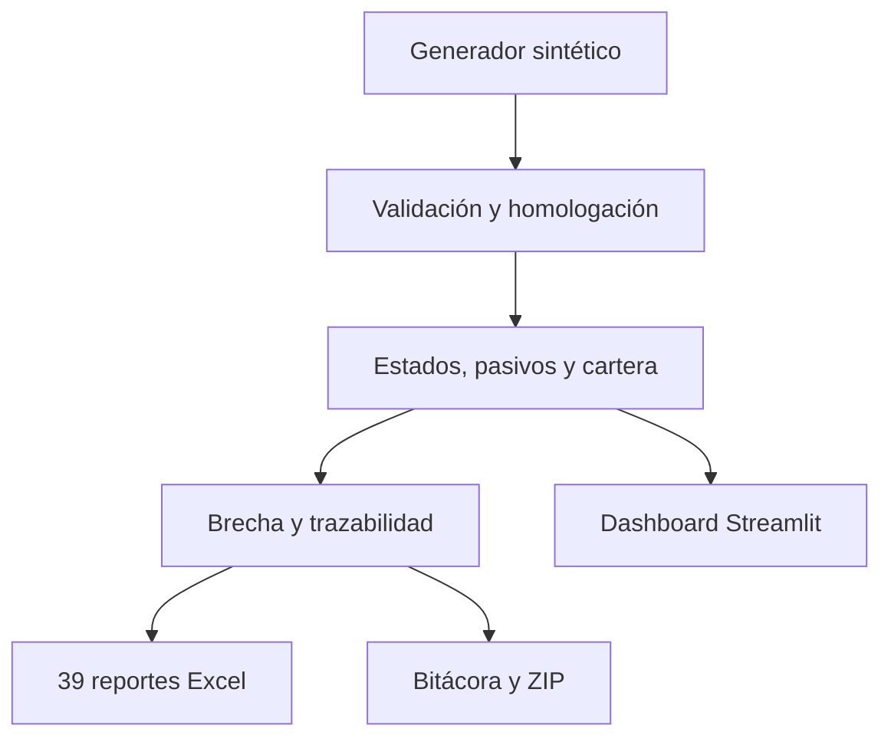

# Abraham Ramsés Gutiérrez Valdés

## Analista de Datos | Business Intelligence | Tesorería

[](https://www.python.org/)
[](https://streamlit.io/)
[](https://github.com/abrahamgutierrez911-ui/finance-portfolio/actions/workflows/tests.yml)
[](PRIVACY_CHECKLIST.md)

Economista egresado con experiencia en automatización de reportes financieros, análisis de datos, procesos ETL y dashboards. Este repositorio presenta reconstrucciones públicas de dos proyectos profesionales mediante datos y entidades completamente ficticios.

> No contiene bases, clientes, cuentas, contratos, saldos, documentos, plantillas ni código interno de ningún empleador.

## Resultados profesionales relacionados

- Aproximadamente **39 reportes financieros**, tres para cada uno de 13 fondeadores.
- Reducción del ciclo de procesamiento de **una o dos semanas a dos o tres días**.
- Reducción aproximada de **75% del tiempo de trabajo** destinado a transformación, reportería y consulta.
- Centralización de posición, flujo bancario, liquidez, pasivos y cartera.

## Demostraciones

### AutomaTES



Ejecuta un pipeline reproducible que genera:

- Estados Financieros Base.
- Maestro de Pasivos Base.
- Reporte de Cartera.
- Brecha de Liquidez.
- Comparativo de trazabilidad.
- Bitácora de ejecución.
- 39 reportes Excel para 13 fondeadores ficticios.
- ZIP descargable con todos los resultados sintéticos.

[Leer el caso de estudio](projects/automatizacion-reportes/README.md)

### Dashboard de Tesorería y Fondeo



Incluye cuatro vistas interactivas:

- Posición bancaria y flujo neto diario.
- Brecha de liquidez por horizonte.
- Concentración de pasivos por fondeador.
- Cartera por producto y estatus.

[Leer el caso de estudio](projects/dashboard-posicion-flujo/README.md)

## Ejecución rápida

### Windows

Ejecuta `ejecutar_demo.bat` o utiliza PowerShell:

```powershell
py -m venv .venv
.venv\Scripts\Activate.ps1
python -m pip install -r requirements.txt
streamlit run streamlit_app.py
```

### macOS o Linux

```bash
python -m venv .venv
source .venv/bin/activate
python -m pip install -r requirements.txt
streamlit run streamlit_app.py
```

La aplicación genera toda la información ficticia en memoria. No necesita descargar bases ni ejecutar preparaciones manuales.

## Pipeline desde terminal

```bash
python scripts/generar_datos_sinteticos.py
python scripts/ejecutar_pipeline.py
```

Los resultados se crean localmente en `output/`, carpeta excluida del repositorio.

## Arquitectura



## Estructura principal

```text
streamlit_app.py            Aplicación unificada del portafolio
automates_app.py            Demo independiente de AutomaTES
dashboard/app.py            Dashboard independiente
src/automates/core.py       Transformaciones y validaciones
src/automates/demo_data.py  Generador de datos ficticios
src/automates/pipeline.py   Orquestación, exportación y bitácora
src/automates/ui.py         Interfaces Streamlit
tests/                      Pruebas funcionales y de privacidad
```

## Pruebas

```bash
python -m pytest -q
```

GitHub Actions ejecuta las pruebas en cada cambio de la rama principal.

## Tecnologías demostradas

- Python, pandas, NumPy, openpyxl y procesos ETL.
- Streamlit y Plotly para interfaces y visualización.
- Excel avanzado, Power Query, Power BI y SQL como experiencia complementaria.
- Validación, trazabilidad, bitácoras, pruebas y automatización de reportería.
- Análisis de posición bancaria, liquidez, cartera, pasivos y fondeo.

## Privacidad

Consulta [PRIVACY_CHECKLIST.md](PRIVACY_CHECKLIST.md) y [SECURITY.md](SECURITY.md). Las reglas públicas son representativas y no reproducen contratos, metodologías, formatos ni procesos confidenciales de terceros.

## Licencia

[MIT](LICENSE) para el código demostrativo creado específicamente para este portafolio.
