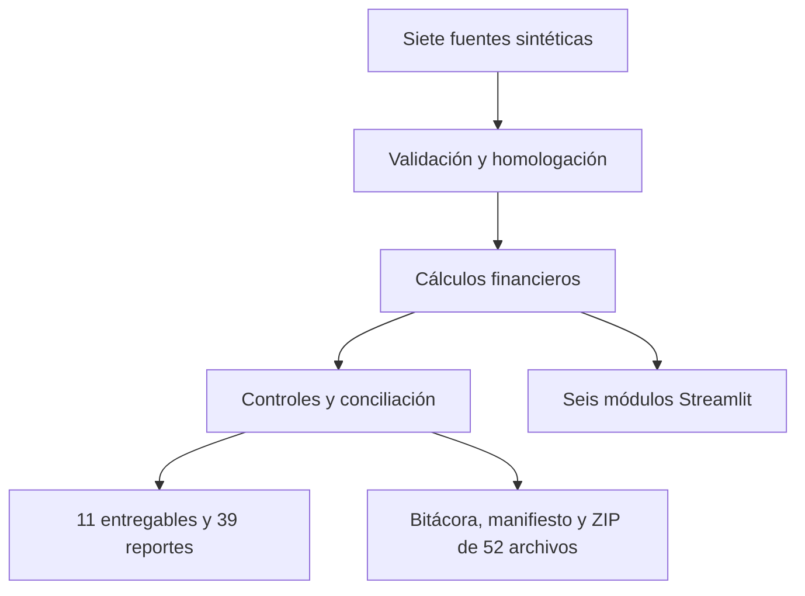

[Leer el caso de estudio](projects/dashboard-posicion-flujo/README.md)


## Ejecución rápida


### Windows


Ejecuta `ejecutar_demo.bat` o utiliza PowerShell:


```powershell
py -m venv .venv
.venv\Scripts\Activate.ps1
python -m pip install -r requirements.txt
streamlit run streamlit_app.py
```


### macOS o Linux


```bash
python -m venv .venv
source .venv/bin/activate
python -m pip install -r requirements.txt
streamlit run streamlit_app.py
```


La aplicación genera toda la información ficticia en memoria. No necesita descargar bases ni ejecutar preparaciones manuales.


## Pipeline desde terminal


```bash
python scripts/generar_datos_sinteticos.py
python scripts/ejecutar_pipeline.py
```


Los resultados se crean localmente en `output/`, carpeta excluida del repositorio.


## Arquitectura



```mermaid
flowchart TD
    A[Siete fuentes sintéticas] --> B[Validación y homologación]
    B --> C[Cálculos financieros]
    C --> D[Controles y conciliación]
    D --> E[11 entregables y 39 reportes]
    C --> F[Seis módulos Streamlit]
    D --> G[Bitácora, manifiesto y ZIP de 52 archivos]
```


## Estructura principal


```text
streamlit_app.py            Aplicación unificada del portafolio
automates_app.py            Demo independiente de AutomaTES
dashboard/app.py            Dashboard independiente
src/automates/core.py       Transformaciones y validaciones
src/automates/controls.py   Conciliación, vencimientos, líneas y controles
src/automates/demo_data.py  Generador de datos ficticios
src/automates/pipeline.py   Orquestación, exportación y bitácora
src/automates/ui.py         Interfaces Streamlit
tests/                      Pruebas funcionales y de privacidad


```


## Pruebas


```bash
python -m pytest -q
```


GitHub Actions ejecuta las pruebas en cada cambio de la rama principal.


## Tecnologías demostradas


- Python, pandas, NumPy, openpyxl y procesos ETL.
- Streamlit y Plotly para interfaces y visualización.
- Excel avanzado, Power Query, Power BI y SQL como experiencia complementaria.
- Validación, trazabilidad, bitácoras, pruebas y automatización de reportería.
- Análisis de posición bancaria, liquidez, cartera, pasivos y fondeo.


## Privacidad


Consulta [PRIVACY_CHECKLIST.md](PRIVACY_CHECKLIST.md) y [SECURITY.md](SECURITY.md). Las reglas públicas son representativas y no reproducen contratos, metodologías, formatos ni procesos confidenciales de terceros.


## Licencia


[MIT](LICENSE) para el código demostrativo creado específicamente para este portafolio.


## Formación complementaria

- [Python de Cero a Machine Learning — Facultad de Economía, UNAM (septiembre de 2026)](DOC-20260909-WA0007.pdf)
